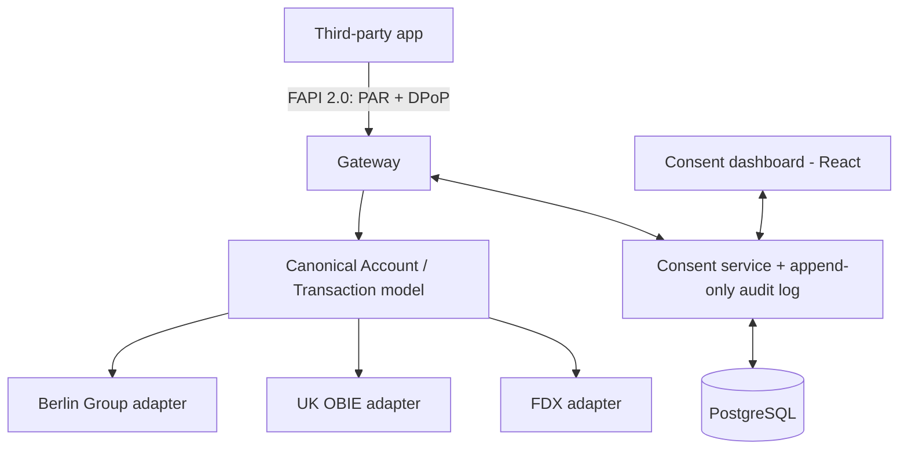

# Open Finance Consent & Data Exchange Gateway

> Open banking has no single global standard — UK OBIE, EU Berlin Group / PSD2, US FDX, and SG SGFinDex all differ, so building across regions means N integrations, and users get opaque, all-or-nothing data sharing. **This gateway gives builders one API and users one switch:** a single canonical model with thin per-standard adapters, secured with FAPI 2.0, and a consent dashboard offering granular, time-boxed, instantly-revocable access.
>
> *Under the hood: a canonical account/transaction model + anti-corruption adapters (Berlin Group, OBIE, FDX), FAPI 2.0 (PAR + DPoP), and an append-only consent audit log.*

**For:** developers / TPPs integrating bank data (one API, not four) — and end users controlling who can see their finances.
**Skill signal:** API engineering · OAuth2 / OIDC / FAPI · financial-standards fluency · API integration
**Region anchor:** UK (OBIE) + EU (Berlin Group / PSD2) primary; FDX (US) + SGFinDex (Singapore) as adapters

[](https://github.com/jzwerg/open-finance-consent-data-exchange/actions/workflows/ci.yml)

---

## Why this exists

There is no single global open-banking standard. The UK has OBIE, the EU has the Berlin Group / PSD2, North America has FDX, Singapore has SGFinDex — each with different schemas and security profiles. A real aggregator builds an **anti-corruption layer**: a canonical internal model plus per-standard adapters. This project demonstrates exactly that, plus the security and consent architecture that regulators actually require.

## Architecture



## Stack

- **TypeScript** (Node / Fastify)
- **OAuth2 / OIDC** authorization server with **FAPI 2.0** security profile (PAR, DPoP-bound tokens)
- **PostgreSQL** — canonical data model + append-only consent audit log
- **React** consent dashboard
- **Docker Compose**

## What makes it stand out

- **Multi-standard anti-corruption layer** — the same account is served correctly through Berlin Group, OBIE, and FDX response shapes from one internal model.
- **FAPI 2.0, not toy OAuth** — Pushed Authorization Requests and sender-constrained (DPoP) tokens, which is what banks actually mandate.
- **Attack/defense demo:** a token-replay attempt against a *revoked* consent is rejected, and the append-only audit log shows the full grant/revoke trail.

See [`docs/product/brief.md`](./docs/product/brief.md) for the product thinking (users, success metrics, non-goals, risks), [`PLAN.md`](./PLAN.md) for the full build plan, and [`docs/adr/`](./docs/adr/) for engineering decisions.

## Run it

```bash
docker compose up        # FAPI 2.0 auth server + gateway + Postgres + consent dashboard  (or: make up)
```

The full stack runs from one command. *(The React consent dashboard can also be deployed standalone to Vercel; the auth server is stateful and stays in the compose stack.)* The proof is in CI: every push runs the security demo in GitHub Actions — a token replay against a **revoked** consent is rejected, and the append-only audit log shows the full grant/revoke trail. A green check means consent revocation actually holds.

> 🎬 *A terminal recording of the revoke-then-replay demo will live here.*

## Status

📋 Planning phase — specification and build plan committed. Implementation to follow.
