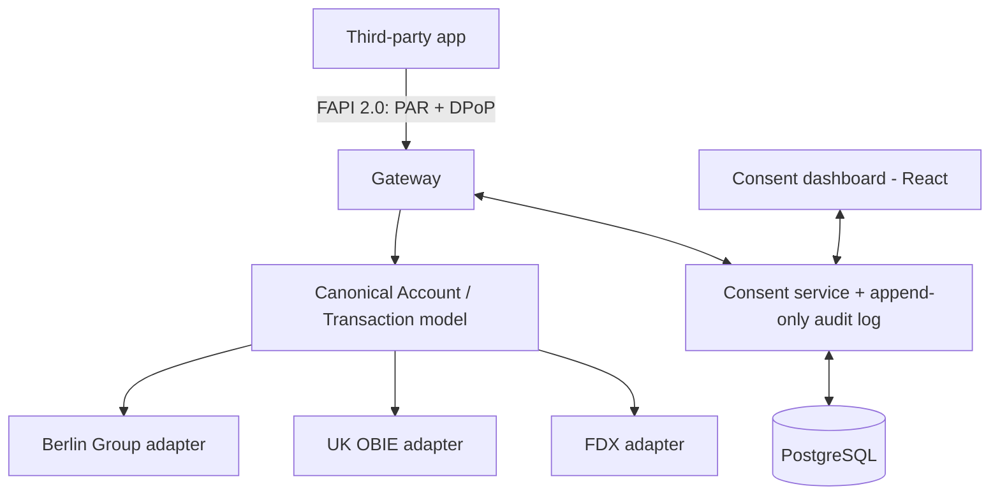

# Open Finance Consent & Data Exchange Gateway

> One gateway, one canonical financial-data model, **thin adapters for multiple regional open-banking standards** (Berlin Group / PSD2, UK Open Banking, FDX), secured with **FAPI 2.0**, with a consent dashboard offering granular, time-boxed, revocable access.

**Skill signal:** API engineering · OAuth2 / OIDC / FAPI · financial-standards fluency · API integration
**Region anchor:** UK (OBIE) + EU (Berlin Group / PSD2) primary; FDX (US) + SGFinDex (Singapore) as adapters

---

## Why this exists

There is no single global open-banking standard. The UK has OBIE, the EU has the Berlin Group / PSD2, North America has FDX, Singapore has SGFinDex — each with different schemas and security profiles. A real aggregator builds an **anti-corruption layer**: a canonical internal model plus per-standard adapters. This project demonstrates exactly that, plus the security and consent architecture that regulators actually require.

## Architecture

## Stack

- **TypeScript** (Node / Fastify)
- **OAuth2 / OIDC** authorization server with **FAPI 2.0** security profile (PAR, DPoP-bound tokens)
- **PostgreSQL** — canonical data model + append-only consent audit log
- **React** consent dashboard
- **Docker Compose**

## What makes it stand out

- **Multi-standard anti-corruption layer** — the same account is served correctly through Berlin Group, OBIE, and FDX response shapes from one internal model.
- **FAPI 2.0, not toy OAuth** — Pushed Authorization Requests and sender-constrained (DPoP) tokens, which is what banks actually mandate.
- **Attack/defense demo:** a token-replay attempt against a *revoked* consent is rejected, and the append-only audit log shows the full grant/revoke trail.

See [`PLAN.md`](./PLAN.md) for the full build plan and [`docs/adr/`](./docs/adr/) for engineering decisions.

## Status

📋 Planning phase — specification and build plan committed. Implementation to follow.
